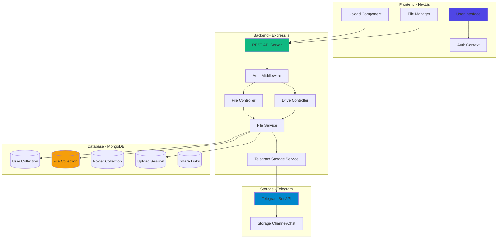
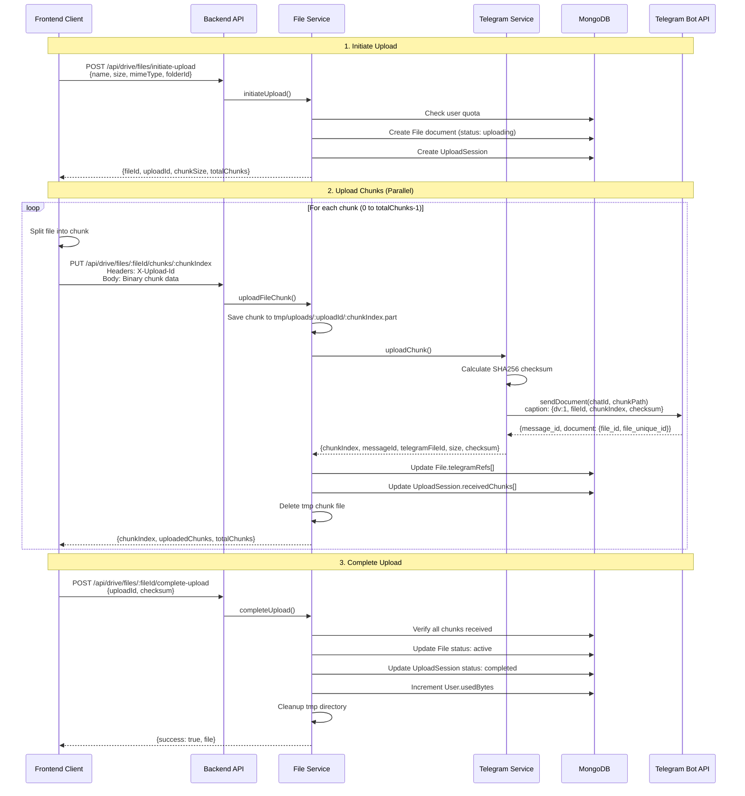
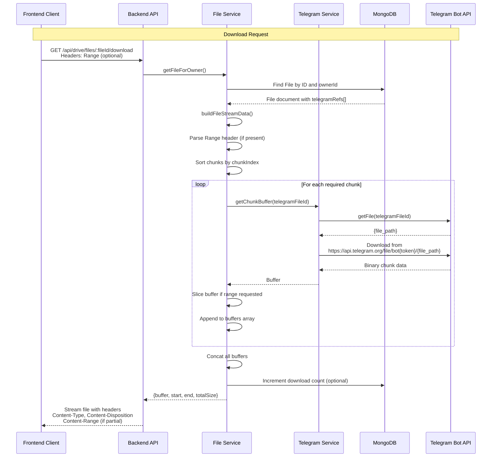
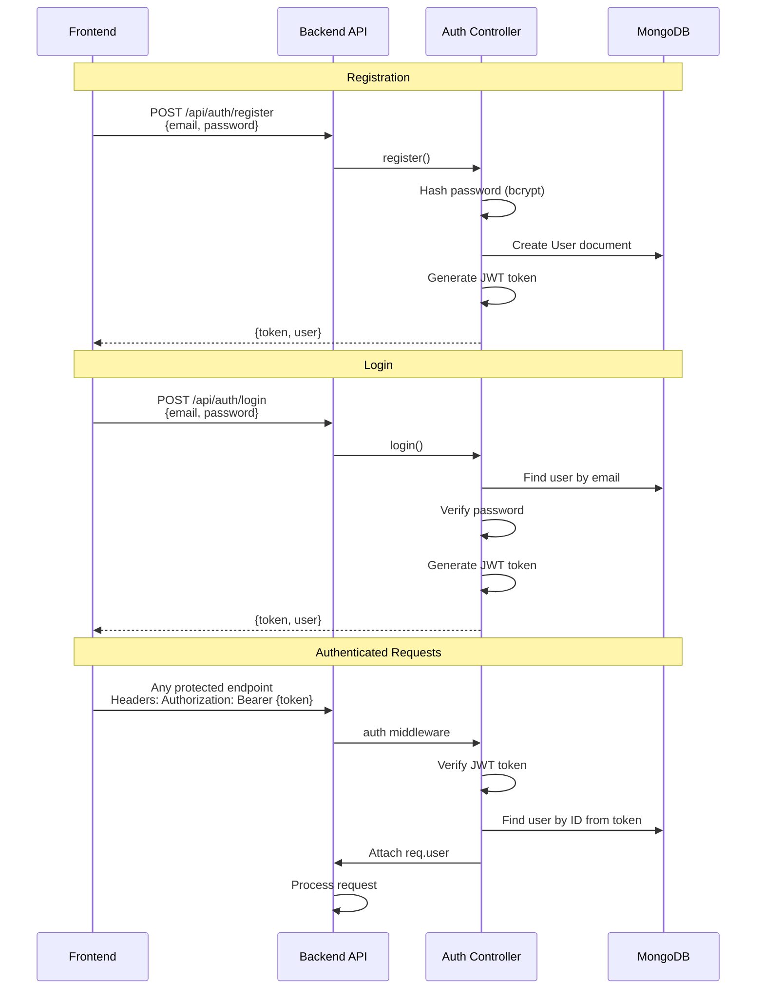
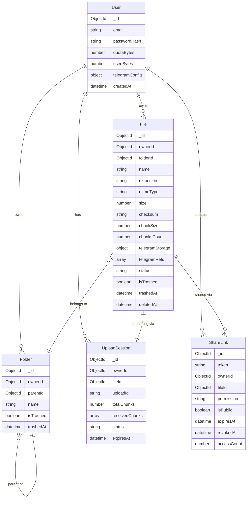

# DataVault

**DataVault** is a cloud storage solution that leverages Telegram as a backend storage provider. It provides unlimited storage by chunking files and storing them in Telegram channels, with a modern Next.js frontend and Express.js backend.

## 🏗️ System Architecture



## 📤 File Upload Flow (Chunking Process)

DataVault splits large files into chunks (default 19MB) and uploads them to Telegram. This allows bypassing Telegram's file size limits and provides efficient parallel uploads.



### Chunk Structure

Each chunk uploaded to Telegram contains:

```json
{
  "caption": {
    "dv": 1,
    "fileId": "mongodb-object-id",
    "chunkIndex": 0,
    "originalName": "example.pdf",
    "checksum": "sha256-hash"
  },
  "document": {
    "file_id": "telegram-file-id",
    "file_unique_id": "unique-id",
    "file_size": 19922944
  }
}
```

## 📥 File Download Flow

When downloading, DataVault retrieves all chunks from Telegram, reassembles them, and streams the complete file to the client.



### Range Request Support

DataVault supports HTTP Range requests for partial downloads and streaming:

- **Full Download**: `GET /api/drive/files/:fileId/download`
- **Partial Download**: `GET /api/drive/files/:fileId/download` with `Range: bytes=0-1000000`

## 🔐 Authentication Flow



## 🗂️ Database Schema



## 🛣️ API Endpoints

### Authentication Routes (`/api/auth`)

| Method | Endpoint | Description | Auth Required |
|--------|----------|-------------|---------------|
| POST | `/register` | Register new user | ❌ |
| POST | `/login` | Login user | ❌ |
| GET | `/me` | Get current user | ✅ |

### Drive Routes (`/api/drive`)

#### File Management

| Method | Endpoint | Description | Auth Required |
|--------|----------|-------------|---------------|
| GET | `/items` | List files and folders | ✅ |
| POST | `/files/initiate-upload` | Start chunked upload | ✅ |
| PUT | `/files/:fileId/chunks/:chunkIndex` | Upload single chunk | ✅ |
| POST | `/files/:fileId/complete-upload` | Finalize upload | ✅ |
| POST | `/files/:fileId/abort-upload` | Cancel upload | ✅ |
| GET | `/files/:fileId/download` | Download file | ✅ |
| POST | `/files/:fileId/trash` | Move to trash | ✅ |
| POST | `/files/:fileId/restore` | Restore from trash | ✅ |
| DELETE | `/files/:fileId/permanent` | Permanently delete | ✅ |

#### Folder Management

| Method | Endpoint | Description | Auth Required |
|--------|----------|-------------|---------------|
| POST | `/folders` | Create folder | ✅ |
| PATCH | `/folders/:folderId/rename` | Rename folder | ✅ |
| PATCH | `/folders/:folderId/move` | Move folder | ✅ |
| DELETE | `/folders/:folderId` | Delete folder | ✅ |

#### Sharing

| Method | Endpoint | Description | Auth Required |
|--------|----------|-------------|---------------|
| POST | `/files/:fileId/share-links` | Create share link | ✅ |

#### Configuration

| Method | Endpoint | Description | Auth Required |
|--------|----------|-------------|---------------|
| GET | `/telegram-config` | Get Telegram config | ✅ |
| PUT | `/telegram-config` | Update Telegram config | ✅ |
| POST | `/reconstruct` | Reconstruct files from Telegram | ✅ |

### Share Routes (`/api/share`)

| Method | Endpoint | Description | Auth Required |
|--------|----------|-------------|---------------|
| GET | `/:token` | Access shared file | ❌ |
| GET | `/:token/download` | Download shared file | ❌ |

## 🔧 Technical Details

### Chunking Strategy

- **Default Chunk Size**: 19 MB (19 × 1024 × 1024 bytes)
- **Reason**: Telegram's file size limit is 20MB for bots; 19MB provides safety margin
- **Configurable**: Can be adjusted per upload
- **Parallel Upload**: Multiple chunks can be uploaded simultaneously

### Encryption & Security

- **Password Hashing**: bcrypt with salt rounds
- **JWT Tokens**: Signed with secret key
- **Telegram Bot Token**: Encrypted in database using AES encryption
- **File Checksums**: SHA256 for integrity verification

### Storage Optimization

- **Deduplication**: Files with same checksum can be referenced
- **Quota Management**: Per-user storage limits enforced
- **Temporary Cleanup**: Upload temp files automatically removed
- **Trash System**: Soft delete with restore capability

### Rate Limiting

- **Telegram API**: Automatic retry with exponential backoff
- **Max Retries**: 5 attempts per Telegram operation
- **API Rate Limit**: 800 requests per 15 minutes per IP

## 🚀 Getting Started

### Prerequisites

- Node.js 18+
- MongoDB
- Telegram Bot Token
- Telegram Channel/Chat ID

### Backend Setup

```bash
cd backend
npm install
cp .env.example .env
# Edit .env with your configuration
npm start
```

### Frontend Setup

```bash
npm install
cp .env.example .env.local
# Edit .env.local with your configuration
npm run dev
```

### Environment Variables

#### Backend (`.env`)

```env
PORT=5000
MONGODB_URI=mongodb://localhost:27017/datavault
JWT_SECRET=your-secret-key
FRONTEND_URL=http://localhost:3000
ENCRYPTION_KEY=32-byte-hex-key
BOT_TOKEN=your-telegram-bot-token
CHANNEL_USERNAME=@your_storage_channel
```

#### Frontend (`.env.local`)

```env
NEXT_PUBLIC_API_URL=http://localhost:5000/api
```

## 📊 File Upload Example (Client-Side)

```javascript
async function uploadFile(file) {
  const CHUNK_SIZE = 19 * 1024 * 1024; // 19MB
  
  // 1. Initiate upload
  const { fileId, uploadId, totalChunks } = await fetch('/api/drive/files/initiate-upload', {
    method: 'POST',
    headers: { 
      'Content-Type': 'application/json',
      'Authorization': `Bearer ${token}`
    },
    body: JSON.stringify({
      name: file.name,
      size: file.size,
      mimeType: file.type
    })
  }).then(r => r.json());
  
  // 2. Upload chunks in parallel
  const uploadPromises = [];
  for (let i = 0; i < totalChunks; i++) {
    const start = i * CHUNK_SIZE;
    const end = Math.min(start + CHUNK_SIZE, file.size);
    const chunk = file.slice(start, end);
    
    uploadPromises.push(
      fetch(`/api/drive/files/${fileId}/chunks/${i}`, {
        method: 'PUT',
        headers: {
          'Content-Type': 'application/octet-stream',
          'Authorization': `Bearer ${token}`,
          'X-Upload-Id': uploadId
        },
        body: chunk
      })
    );
  }
  
  await Promise.all(uploadPromises);
  
  // 3. Complete upload
  await fetch(`/api/drive/files/${fileId}/complete-upload`, {
    method: 'POST',
    headers: {
      'Content-Type': 'application/json',
      'Authorization': `Bearer ${token}`
    },
    body: JSON.stringify({ uploadId })
  });
}
```

## 🎯 Key Features

- ✅ **Unlimited Storage**: Leverage Telegram's infrastructure
- ✅ **Chunked Uploads**: Handle files of any size
- ✅ **Parallel Processing**: Fast upload/download speeds
- ✅ **Range Requests**: Stream large files efficiently
- ✅ **File Sharing**: Generate shareable links
- ✅ **Folder Organization**: Hierarchical file structure
- ✅ **Trash & Restore**: Recover deleted files
- ✅ **Quota Management**: Per-user storage limits
- ✅ **Encryption**: Secure storage of credentials
- ✅ **Modern UI**: Next.js with Tailwind CSS

## 📝 License

ISC

## 🤝 Contributing

Contributions welcome! Please open an issue or submit a pull request.

---

**Built with ❤️ using Next.js, Express, MongoDB, and Telegram**

```bash
PORT=XXX
JWT_SECRET=XXX
MONGODB_URI=XXX
BOT_TOKEN=XXX
CHANNEL_USERNAME=XXX
FRONTEND_URL=XXX
```